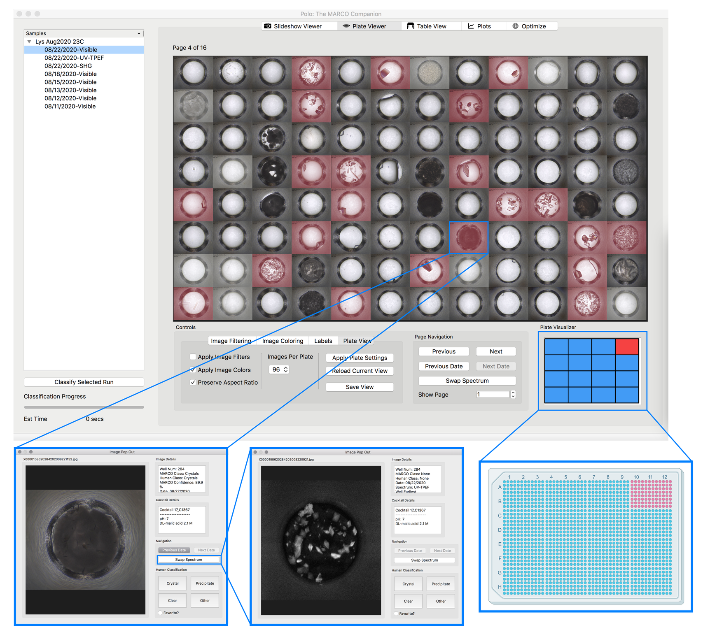
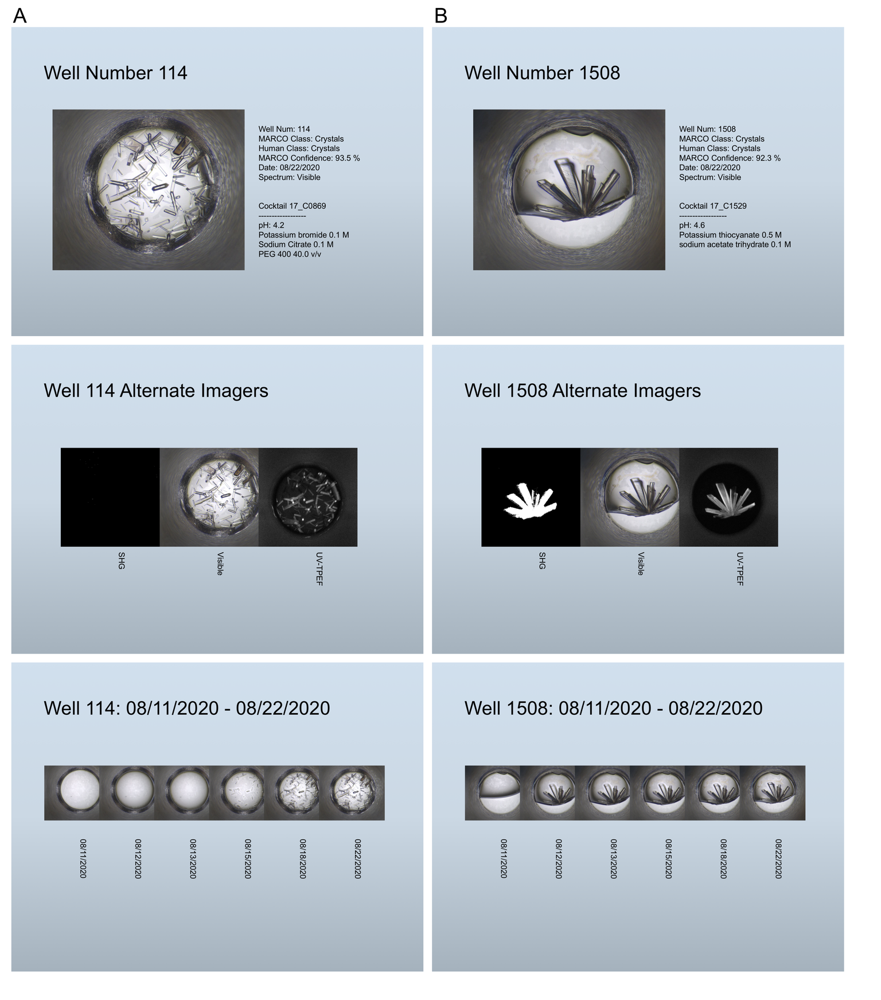

# Background

One of the largest challenges in obtaining X-ray diffraction
data from biological samples is growing large, high quality crystals.
Currently, there is not way to reliably predict successful crystallization
conditions based on protein sequence alone and so high-throughput approaches
are very appealing. High-throughput crystallization screens test a large
chemical space using hundreds of different crystallization cocktails at the
nano-drop scale. Successful conditions can then be scaled up and optimized to
grow larger crystals.

The High-Throughput Crystallization Screening Center at the Hauptman-Woodward 
Medical Research Institute provides this high-throughput screening service to
users, offering 1536 condition screens for both soluble and membrane protein
samples. Each plate is imaged over a period of two months using
brightfield microscopy, as well as SHG and UV-TPEF microscopy, using Formulatrix Rock Imagers.

This high-throughput produces a large volume of images that must be
sorted through in order to pick out the best condition; a task that can be
very tedious and repetitious.

In 2019 Bruno *et al* published [Classification of crystallization outcomes using deep convolution neural networks](https://journals.plos.org/plosone/article?id=10.1371/journal.pone.0198883)
which included a CNN model that could accurately classify crystallization screening
images, opening the door to automating this process. The MARCO model is open-source and available for users to implement, and has been incorporated into See3 software for Collaborative Crystallization Centre (Australia) users, but has not been available in an average-user oriented graphical user interface (GUI) program.

Polo is therefore designed to incorporate the benefits of the MARCO model
and integrate the functionality of established crystallization image
labeling software such as [MacroscopeJ](https://hwi.buffalo.edu/wp-content/uploads/2016/11/MsjManual-0_1_1_3.pdf)
to create a GUI targeted for HWI Crystallization Center users and others with crystallization screening
experiments.  Polo incorporates all the tools needed to go from raw crystallization images
to designing optimization screens without the need to install any dependencies.

For more information, please visit the documentation page linked below.

# Use Polo

## Install Polo

[Download the latest release here](https://github.com/Hauptman-Woodward/Marco_Polo/releases). A self-installing version is available for Windows 10. Executable files are available for Mac OS >= High Sierra and Ubuntu >= 18. Please see the [installation help page](https://hauptman-woodward.github.io/Marco_Polo/install.html#os-specific-installation-notes) of the Polo website for solutions to common issues users have encoutered. 

If you encounter a problem that is undocumented, please let us know either through the [bug reports and suggestions form](https://hauptman-woodward.github.io/Marco_Polo/reports.html) or by opening an issue in this repository. 

## Learn Polo

We have created a number of reasources to help you get going with Polo. If you prefer textual guides you can visit the [User's Guide](https://hauptman-woodward.github.io/Marco_Polo/user_guide.html) page of the Polo website. If you are more of a video tutorial person check out the [Video Guides](https://hauptman-woodward.github.io/Marco_Polo/video_guides.html) page where Ethan will walk you through how to use some of Polo's primary interfaces.

## Improve Polo

Polo strives to be accessible, easy to use and reduce human work. If you have a suggestion of how any of these or other aspects of the program could be improved please make it known! You can do so through the [suggestion form](https://hauptman-woodward.github.io/Marco_Polo/reports.html) or by opening an issue on this repository. Pull requests encouraged!

## Run and compile from source

If you are running Polo on an OS for which there is not a binary file you may follow these steps
to first get Polo running and then use Pyinstaller to create your own binary file if you wish.
  

0. Clone this repository to your favorite location on your machine. It is important you feel that
this is a special place in your file tree to ensure Polo is at home and feels safe. 

1. Install the dependencies in a new conda environment from the included `environment.yml` file. You can do this with the command `conda env create -f environment.yml`
2. Activate this conda environment (at the time of writing) this command would be `conda activate polo0.2.1`
3. Navigate to the `src` directory included in the Polo repository. And run `python Polo.py`. The program should launch the GUI. You can use Polo just as you would a binary file now, but you will need to repeat this process from step `2` to launch the program again.

If you would like to compile Polo into a single binary file for your machine please continue, be warned though that Pyinstaller (the program used for mashing everything into an executable file) can sometimes be a bit particular. Disclaimer over.

4. Navigate back to the repository root directory. You should find a file called `Polo.spec`. This contains the information that Pyinstaller (in theory) needs to create the binary file.
5. Run the command `pyinstaller Polo.spec F`. This should create your binary file in a new directory called `dist`. You should then be able to run this file and launch the Polo GUI. 

See `Contact` if you encounter issues at any of these steps.

# Features

## Slideshow Viewer

View your images serially, in a slideshow like format, with or without running the MARCO model. Sort images by their human or MARCO classification and/or classification confidence. Imaging runs of the same sample are automatically linked allowing for easy creation of time-resolved views. Toggle UV-TPEF or SHG (or both) images when available with one click to confirm the presence of crystals in a well. 

## Plate Viewer

You can also view many images at once using the Plate Viewer which helps with rapid initial screening of images. Highlight images within a grid by their human or MARCO classification to make confirmed or potential crystal hits stand out. Select imaging images to open them in a zoomed in viewer.

## Export to Useful Formats

Polo allows you to share your results with other humans or machines easily. Export images of a specific classification along with their cocktail and plate data to a ready-to-present PowerPoint (pptx) like the one shown above or to machine parsable formats like csv or json. 

# Helpful Links

- [Documentation](https://hauptman-woodward.github.io/Marco_Polo/)
- [2020 SSRL / LCLS Users' Meeting Poster and Live Session](https://events.bizzabo.com/SLAC-UsersMeeting-2020/agenda/session/363994)

# Contact

If you encounter issues or have questions about the program please reach out to me (Ethan Holleman) via email. I will do my best to get back to you quickly but please be aware that Polo is not currently my primary research focus as a PhD student at UC Davis. 

`etholleman [ @at@ ] ucdavis [ .dot. ] edu`