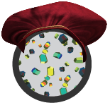

.. Polo documentation master file, created by
   sphinx-quickstart on Sat Jul 18 10:57:21 2020.
   You can adapt this file completely to your liking, but it should at least
   contain the root `toctree` directive.

Welcome to Polo's documentation!
================================

Polo is a python GUI build using the PyQt library for
high-throughput crystallization screening users. It was created by Ethan Holleman
for the 2020 `BioXFEL <https://github.com/EthanHolleman/Marco_Polo/issues>`_ 
summer internship program.

.. toctree::
   :maxdepth: 2
   :caption: Contents:

   about
   install
   FAQS
   user_guide
   beta_testers
   polo

Indices and tables
==================

* :ref:`genindex`
* :ref:`modindex`
* :ref:`search`
