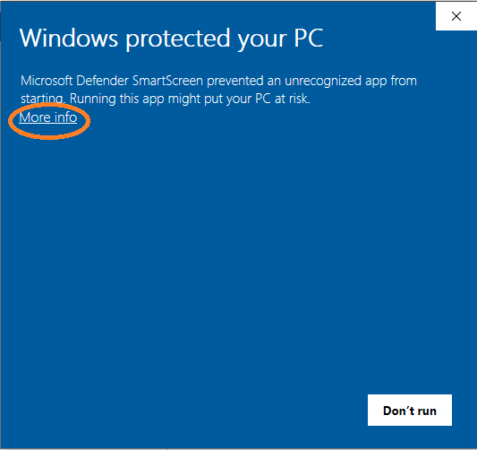

Installation Guide
=========================

Please visit `the GitHub Release page <https://github.com/EthanHolleman/Marco_Polo/releases>`_
and follow the install instructions for the latest release for your operating
system, but before you do please review the OS specific notes below.

OS Specific Installation Notes
==========================

Windows
---------------------------

A full installer is available for Windows 10. It is highly recommended to only
install polo for the local user (this is the default) as otherwise Polo will
require administrator privileges to run properly. 

Additionally, it is likely that when you try to run the installer you will
be greeted with this prompt from Windows warning you that Polo is from
an unverified publisher. 

If you wish to continue the install select "More Info".

This will show the "Run Anyway" button. Select it to proceed with the installation.

.. image:: images/run_anyway.png
    :align: center

If you are concerned about the content of Polo please feel free to visit the
GitHub page where all code is available for review.

Mac and Ubuntu
---------------------------

While there is no installer available for Mac and Ubuntu Linux, executable
files are. Your machine is likely to have similar security concerns to
Windows about running an exe you downloaded from the internet so you may need
to take special action the first time you run Polo.

On Mac you can follow the steps below to give Polo permission to run.

1. In the Finder, locate the app you want to open. Don’t use Launchpad to do this. Launchpad doesn’t allow you to access the shortcut menu.

2. Control-click the app icon, then choose Open from the shortcut menu.

3. Click Open.

This will add Polo to your list of approved programs.

On Ubuntu (or Mac) you can give Polo permission to run as an executable
with the command :code:`sudo chmod +x Polo` in the directory your Polo
exe is located in.

For any operating system, if something isn't working correctly, doesn't seem
intuitive or you think could work better please let me know! Please
see the :ref:`I Found a Bug` section for more information on how to report
issues and make suggestions.

Running From Source
=========================

If you do not want to use the binary files, you can run Polo like any
other Python program. Steps to do so are below.

1. Create a python 3.5 virtual environment. I used conda for this, but there are many other options. This is high recommended as Polo is dependent on some legacy versions of common packages like TensorFlow.

2. Activate your newly created virtual environment

3. Make sure you are using the latest version of pip. You can update using the command :code:`pip install --upgrade pip`.

4. Install all the dependencies in the includes :code:`requirements.txt` file. This can be done most easily with the command :code:`pip install -r requirements.txt`.

5. You now should be able to run Polo with the command :code:`python Polo.py`

