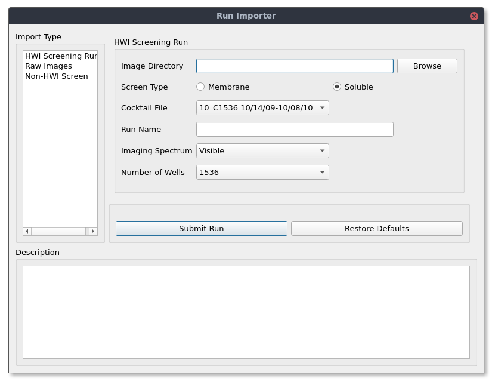
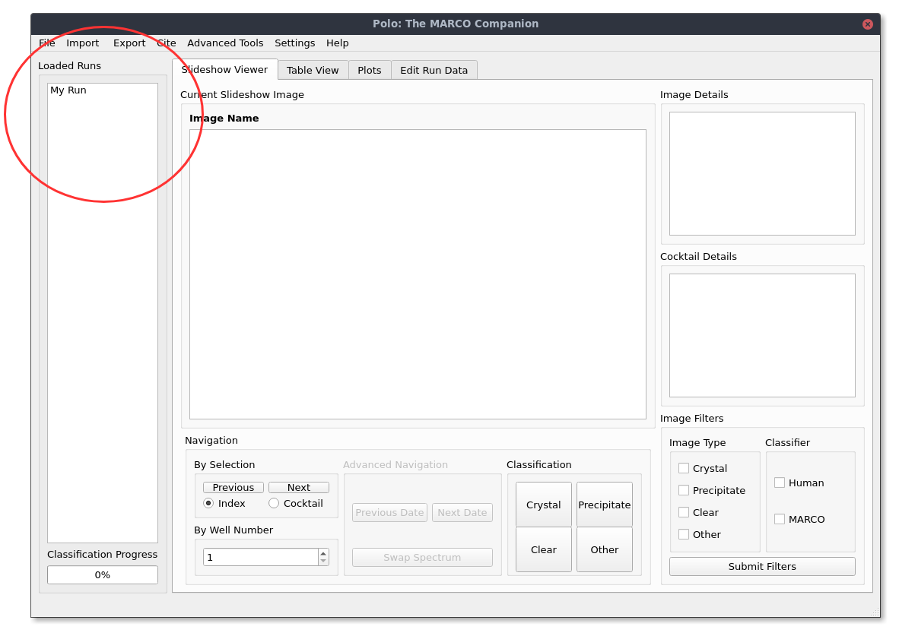
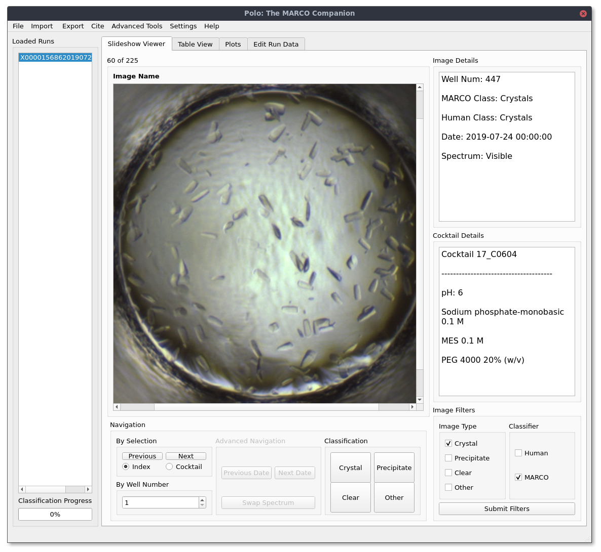

User's Guide
=============

If you have yet to install Polo on your machine, head to the installation
guide here.

Importing and Opening Image Data
##################################

The first step to using Polo is adding your own data. Polo organizes data into "runs", which
consist of a set of related screening images. Polo organizes runs into three different
categories which are described below.

- HWI Screening Runs
- Non-HWI Screening Runs
- Raw Image Collections

Getting Your Data (via FTP)
------------------------------
If you do not already have your data downloaded to your local machine, Polo
includes an FTP file browser which utilizes Python's ftplib package. For
HWI users this allows you to download your screening images from the
HWI server without leaving the application. 

To open the FTP file browser, on the menubar navigate to Import -> Images
-> From FTP. Enter your credentials in the new window.Once you are 
connected to a server files available to download will be listed in the browser menu.
Select the checkboxes next to the files you wish to download, or select
all files in a directory at once. Pressing "Download Selected Files"
will start the download.

Using the Run Importer
-----------------------

To import a new run into Polo for classification head to the menubar and
click Import -> Images -> New Run. This will open a new window that will
look similar to the one below.

The selection box under "Import Type" lists the three run types you can
import. Only one type may be imported at a time. Fill in the fields listed
for the run type you wish to import and hit "submit run" to import your
image data into Polo. Once you select a directory Polo will fill in fields
automatically based on any metadata it finds. This is done most extensively
for HWI Screening Runs and unless you know what you are doing it is
recommended to use the Polo suggested settings.

Importing a Saved Run
-----------------------

One of the advantages of Polo is the introduction of the .xtal file format. Xtal
is a json file that can store all your run data, including images, classification and
other metadata in a single, portable format. If you have an xtal file from a previously
saved run you can load it into Polo by navigating to the menubar and selecting
Import -> Images -> From Saved Run. A file browser will open and you can select
your .xtal file and pick up where you left off.

Opening a Run
--------------

Once a run has been successfully imported, the run name will appear in the
loaded runs list, like in the image below.

If it is a new run double clicking on the run name will run the MARCO model
on the run's images. You can check on MARCO's progress by using the
Classification Progress bar located just below the Loaded Runs list.

Once a run has been classified you can load it into the current view
by double clicking on it again.

Using the Slideshow View
############################

The slideshow view is the main Polo user interface. It allows you to view
your screening images, label them and filter them by MARCO classifications,
your own classifications or both. 

Navigation
---------------
Once you have images loaded in you can cycle through images by
pressing the next or previous image buttons under the navigation
panel. You can also use the right or left arrowkeys respectively.

If you are viewing an HWI Screening Run you will be able to toogle
between ordering images by index (well numbe) or by cocktail number. Also
for HWI runs, you can navigate directly to an image by well number by using
the By Well Number selector also in the Navigation panel.

It is also posssible to move between runs that may be of the same protein
sample but imaged at a different time or with a different optical
technology. See the Advanced Settings section for more details on
these features.

Classification
-----------------
Arguebly the most important Polo feature is the ability to easily
label your screening images. To label the currently displayed image
press the button in the classification panel with your desired label.
You can classify images as Crystal, Precipitate, Clear or Other. 
See this link for more details on each classifiction. To increase
your speed you can classify images using keyboard shortcuts which are
listed below.

- A: Crystal
- W: Precipitate
- S: Clear
- D: Other

Classifiying an image will automatically move you to the next image in
the slideshow.

Filtering
-------------

Using the checkboxes under the Image Filter's panel in the lower
right corner of the window will allow you to filter the kinds of
images in your current slideshow. For example if you only wanted to
see images that MARCO has classified as Crystal you could check the Crystal box
under Image Types and MARCO under the Classifier panel. If you had checked Human
instead only images that you have classified as Crystal would be shown. 

You can reset the slideshow to include all images by selecting all checkboxes
or no boxes and pressing submit filters.

Image Metadata
-----------------

Image metadata will be displayed in the Image Details and Cocktail Details
windows when it is available. Image details will give you basic information about
the image currently being displayed, such as well number, imaging technology
imaging date and current classifications. If you are viewing an HWI run
the chemical conditions the current image was plated in will be displayed in the
Cocktail Details window.

Using the Table View
############################

Using Plot Functions
############################

Editing Run Data After Loading
################################

Editing Run Date
------------------

Editing Run Name
-------------------

Adding Annotations
-------------------

Deleting a Run
-------------------

Saving a Run
####################

.xtal File Format
----------------------

Exporting a Run
######################

HTML and PDF Reports
---------------

CSV Exports
---------------

