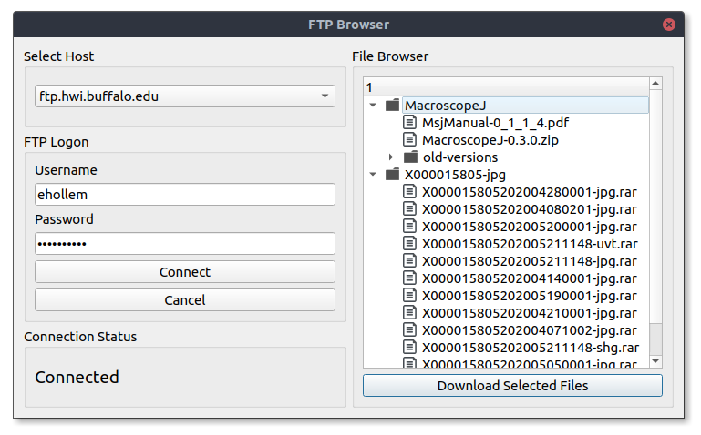
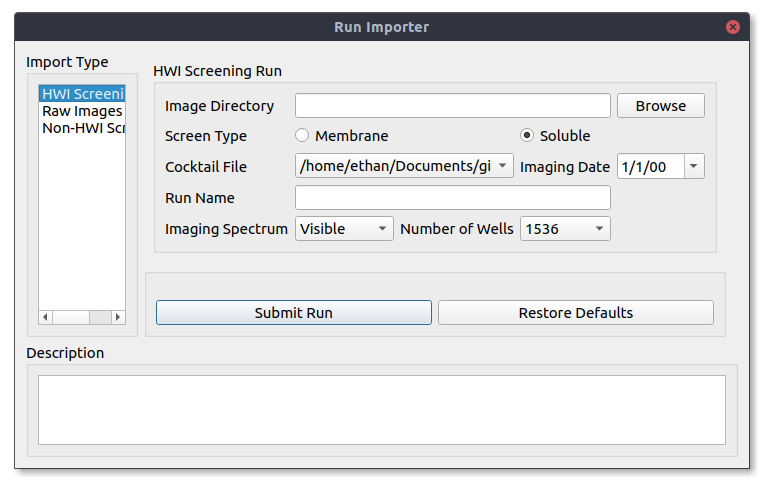

User's Guide
=============

If you have yet to install Polo on your machine, head to the installation
guide here.

Importing and Opening Image Data
##################################

The first step to using Polo is adding your own data. Polo organizes data into "runs", which
consist of a set of related screening images. Polo organizes runs into three different
categories which are described below.

- HWI Screening Runs
- Non-HWI Screening Runs
- Raw Image Collections

Getting Your Data (via FTP)
------------------------------
If you do not already have your data downloaded to your local machine, Polo
includes an FTP file browser which utilizes Python's ftplib package. For
HWI users this allows you to download your screening images from the
HWI server without leaving the application. 

To open the FTP file browser, on the menubar navigate to Import -> Images
-> From FTP. Enter your credentials in the new window. Once you are 
connected to a server files available to download will be listed in the browser menu.

Select the checkboxes next to the files you wish to download, or select
all files in a directory at once. Pressing "Download Selected Files"
will start the download. 

Since these are large files, Polo will download them in the background so you
can continue to the program normally. Once all files are downloaded Polo will
notify you that your download is complete. Closing Polo before this will
result in an incomplete download.

Importing Images from a Directory
-----------------------

Once you have your images on your local machine you can import them into
Polo by using the Run Importer tool. It can be opened by navigating to the
menu bar and selecting Import -> Images -> From Directory. A window like
the one below will then open.

If you are importing HWI screening images select **HWI Screening Run** from
the **Import Type** window (Beta testers do this). Select **Browse** to open
a file browser and select the directory containing the images you want to
import. 

Other import types are included for compatibility with other
high-throughput protocols but metadata for these import modes is out of
the scope of the program. This means runs imported as these types will have
fewer available features.

However, since HWI has standard naming conventions Polo will suggest settings for your
run including what cocktail file to use, the date of imaging, the spectrum
and the number of wells. However, if you want to change any of these settings
you are free to do so.

Once you are happy with your import click **Submit Run** to load your
images into Polo.

Importing a Saved Run
-----------------------

One of the advantages of Polo is the introduction of the .xtal file format. 
Xtal is a json like file that can store all the data relating to an individual
screening run in a single file with no other dependencies. Xtal files store
images, classifications, cocktail data and other annotations made while using
the Polo program.

If you have xtal file ready for import you can load it into Polo by navigating
to the menu bar and selecting **Import** -> **Images** -> **From Saved Run**.
This will open a file browser and allow you to select the xtal file you wish
to import.

Opening a Run
--------------

Once a run has been successfully imported, the run name will appear in the
**Loaded Runs** list, like in the image below.

If it is a new run double clicking on the run name will run the MARCO model
on the run's images. You can check on MARCO's progress by using the
**Classification Progress** bar located just below the Loaded Runs list. Polo
will also attempt to estimate the time remaining in your classification job.

 .. image:: ./images/mid_class.png
   :alt: Polo mid-classification

Once a run has been classified you can load it into the current view
by double clicking on it again. This will set the selected run as your
**Current Run** and all actions will be taken in reference to this run.
You can change your current run by double clicking another loaded run in the
**Loaded Runs** tab.

 .. image:: ./images/loaded_image.png
   :alt: Image loaded into the slideshow view after the run as been classified.

Using the Slideshow View
############################

The slideshow view is the main Polo user interface. It allows you to view
your screening images, label them and filter them by MARCO classifications,
your own classifications or both. 

 .. image:: ./images/loaded_image.png
   :alt: Object structure model

Basic Navigation
---------------
Once you have images loaded in you can cycle through them by
pressing the **Next** or **Previous** image buttons under the navigation
panel. You can also use the right or left arrowkeys respectively. If you are
viewing an HWI screening run you can also navigate directly to a specific
well number by entering the well number into the **By Well Number** box.

Classification
-----------------
Arguably the most important Polo feature is the ability to easily
label your screening images. To label the currently displayed image
press the button in the **Classification** panel with your desired label.
You can classify images as Crystals, Precipitate, Clear or Other. To increase
your speed you can classify images using keyboard shortcuts which are
listed below.

- 1: Crystal
- 2: Precipitate
- 3: Clear
- 4: Other

Classifying an image will automatically move you to the next image in
the slideshow.

Filtering
-------------

Using the checkboxes under the **Image Filters** panel in the lower
right corner of the window will allow you to filter the kinds of
images in your current slideshow. For example if you only wanted to
see images that MARCO has classified as Crystal you could check the Crystal box
under **Image Types** and MARCO under the **Classifier** panel. If you had checked Human
instead only images that you have classified as Crystal would be shown. 

You can reset the slideshow to include all images by selecting all checkboxes
or no boxes and pressing submit filters.

Image Metadata
-----------------

Image metadata will be displayed in the **Image Details** and **Cocktail Details**
windows when it is available. Image details will give you basic information about
the image currently being displayed, such as well number, imaging technology
imaging date and current classifications. If you are viewing an HWI run
the chemical conditions the current image was plated in will be displayed in the
**Cocktail Details** window.

Using the Plate Viewer
############################
To view multiple images in a grid you can utilize the **Plate Viewer**, which
can be found under the **Plate Viewer** tab. When you first open it up, it will
look something like the image below.

 .. image:: ./images/plate_view.png
   :alt: The plateviewer tab.

Basic Controls
-----------------------------

Assuming you have a run loaded and selected press **Reload Current View** button
to load in some images with the current settings.

 .. image:: ./images/plate_24.png
   :alt: The plateviewer tab.

You can adjust the number of images shown in the grid by using the 
**Images Per Plate** combo box and pressing **Reload Current View**.

 .. image:: ./images/plate_96.png
   :alt: The plateviewer tab.

You can navigate to the next or previous view by using the **Next** or
**Previous** buttons respectively.

Image Filtering and Coloring
-------------------------------
The Plateviewer window allows you to highlight images by either their MARCO
classification or the one you have given them. This allows you to find true
hits faster. First we will look at how to color images by their classification.

Open the **Image Coloring** tab on the bottom of the Plateviewer window.
Use the combo boxes to assign a color to each classification type. The
**MARCO** and **Human** radiobuttons tell Polo what classifier to use.
After you have picked out a color scheme switch back to the **Plate View** tab
select the **Apply Image Colors** checkbox and
press the **Apply Plate Settings** button to color your images.

.. note::  The **Apply Image Colors** checkbox must be selected for colorings to be applied.

A 96 well view with colors applied to all MARCO classifications.

 .. image:: ./images/colo_96.png
   :alt: The plateviewer tab.

A disappointing 96 well view with only the Crystal classified images colored blue.

 .. image:: ./images/one_colo_96.png
   :alt: The plateviewer tab.

Similarly, images can also be emphasized and deemphasized by either their
human or MARCO classification. Use the checkboxes under the **Image Filtering**
tab to select which images to emphasize. Then switch back to the **Plate View** tab
and check the **Apply Image Filters** box and hit **Apply Plate Settings**.

The same view as above but only selecting for MARCO classified crystal images.

 .. image:: ./images/filter_96.png
   :alt: The plateviewer tab.

Detail View
--------------------------------
If you see an image that looks interesting you can select it and it will be
opened in a popout window like the one below. Here you can view details about
the image and assign it a classification using the buttons in the **Human Classification**
panel.

 .. image:: ./images/pop.png
   :alt: The plateviewer tab.

Using the Table View
############################

The table view allows you to view a run in a spreadsheet like view and does
not display images.

 .. image:: ./images/table.png
   :alt: The plateviewer tab.

Filtering
----------------------
Just like the **Slideshow Viewer** and **Plate Viewer** tabs you can filter
what data is shown to you in the table view. For those familiar with SQL this
is like a SELECT / WHERE statement. Press the **Apply Settings** button to
apply your currently selected filters.

 .. image:: ./images/filter_table.png
   :alt: The plateviewer tab.

Using Plot Functions
############################
Polo utilizes the Matplotlib python library to provide a few diagnostic
plots to give you more information on your screening run. Once a run is loaded
in plots can be viewed by selecting the **Plots** tab.

Classification Counts
---------------------------

Visualize human and MARCO classifications by image type.

 .. image:: ./images/class_counts.png
   :alt: The plateviewer tab.

MARCO Accuracy
-----------------------

View a basic bar graph of MARCO classification accuracy. Correct classifications
are those where the model applied the same classification as the human.

 .. image:: ./images/mark_acc.png
   :alt: The plateviewer tab.

Plate Heatmaps
---------------------------

View the MARCO model confidence for each image classification across
all images in your screening run.

 .. image:: ./images/heat.png
   :alt: The plateviewer tab.

Saving a Plot
----------------------------
If you wish, you can save a plot as an image to your machine by
using the plot control icons at the bottom of the **Plots** tab. Select the
floppy disc to save the current plot.

Using the Optimize Tool
#############################

Once you have identified crystal containing wells, you can easily
design optimization screens using the optimize tool. The optimize tool
automatically creates screens around the cocktail conditions a crystal hit
grown in.

Currently all conditions come directly from HWI screening conditions and changing
the conditions manually is not currently supported.

For more information on
optimization protocols you can read this document provided by HWI,

`Reproducing HWI HTCSC crystallization screening hits <https://hwi.buffalo.edu/wp-content/uploads/2017/10/ReproduceCrystalLeads.pdf>`_

 .. image:: ./images/optimize.png
   :alt: The plateviewer tab.

Setting Up Your Plate
---------------------------------
The first thing to do is to tell Polo what the plate you will be using for
your optimization screen. Set the number of wells in your plate by adjusting
the plate dimensions.

For example a standard 24 well plate could have 6 wells on X axis and 4 on
the Y or vice versa. Which value you assign to which axis is arbitrary as
long as you assign the reagent you want to screen for on that same axis.

You should also adjust the well volume by using the **Well Volume** and associated
units combo boxes. This volume will be used as the maximum volume for each well.

Selecting Reagents
-------------------------------
Once your plate is set up you are ready to select reagents to screen for.
Wells you have classified as crystal containing are listed in the **Hit Well**
combo box under the **Reagent Controls** panel. Selecting a well will display
its containing reagents under the **Assign Reagents** combo boxes of the
**X Reagent** and **Y Reagent** tabs.

.. note::  A reagent assigned under the **X Reagent tab** will be varied on the X-axis of the plate and the reagent assigned under the **Y Reagent** tab will be varied on the Y-axis of the plate.

Since any given plate only has two axis only two reagents can be screened for,
but many crystallization cocktail contain three or more reagents. Reagents not
assigned to either the x or y reagent will be considered constant and will
be present in your final screen but always at the same concentration.

Once you have assigned your reagents set a stock concentration for each reagent and
select a percentage to the x and y reagents by. This is always in reference to the
hit concentration for the particular reagent.

For example if you selected citric acid as your x reagent and it was present
in the crystallization cocktail at a concentration of 0.5 M the concentration
of citric acid in your optimization screen will be varied in reference to
0.5 M by the percentage selected in the **Vary each well by** spin box.

Additionally, the hit concentration is always the center most well of the
axis. Meaning if there are 6 wells on your plate's x-axis you can expect
the concentration of citric acis in the 3rd well to be 0.5 M (using the
example above).

Viewing Your Optimization Screen
-------------------------------------
After everything is set up, press **Show Screen** to display your
current optimization screen. It will look something like the image below.

 .. image:: ./images/screen.png
   :alt: The plateviewer tab.

If it does not fill the screen slightly adjust the size of the Polo window and
it should snap into place.

Exporting A Screen
------------------------
After setting up your screen you can export it to an html file to print
and / or share with your friends. To do so just hit the **Export** button.
This will open a file browser and you can select where you would like to
save the file. You can then open the file with any browser to view it or
save it as a pdf.

Advanced Tools
####################
Advanced tools go a bit beyond image classification and viewing and allow you
to take advantage of the fact a single screening run will likely be imaged at
multiple points in time and with multiple imaging technologies. All tools
described below can be found by navigating to the menu bar and selecting 
**Advanced Tools**.

Time Resolved Runs
---------------------

Usually, the sample plate will be imaged at multiple points in time. Polo allows
you to link these runs together using the **Add Time Resolved** tool under
**Advanced Tools**. Polo will automatically determine the order of the runs
based on their date and then allow you to navigate between them in both
the Slideshow Viewer tab and Plate Viewer tab using the **Next Date** and
**Previous Date** buttons.

Adding an Alternative Spectrum
-------------------------------
Oftentimes, the same plate will be imaged with a photographic technology
besides microscopy in order to verify the presence of crystals in a sample.
If you have images taken with such a technology you can identify them as such
in the **Run Importer** window (link here).

Then navigate to **Advanced Tools** and select **Add Spectrum** which will
open a dialog like the one shown below.

Valid runs will automatically be assigned to an image category based on the
spectrum they were assigned at import. Select one run from each category that
you would like to link and when finished press **Submit Assignment**.

You will then be able to swap between these images in both the Slideshow Viewer
and Plate Viewers. This can be very useful for verifying a crystal is in fact
a protein crystal and not salt.

Saving a Run
####################

Once you have invested time into picking out the best screening conditions you
are going to want to save your work and share it with others. The best way to
do this in Polo is by saving your current run as a .xtal file.

.xtal File Format
----------------------

.xtal is a json based format for saving screening runs after they have been
loaded into and processed using Polo. It will maintain all of your image
classifications and metadata in a single file. Additionally, the actual
screening images are encoded directly into the xtal file which makes sharing
your data to another Polo user very easy as it only requires sharing the
single .xtal file.

Actually Saving Your Run
----------------------------
To save your Run from Polo, navigate to the menu bar and and select
**File** -> **Save** or **Save As**. If you have not saved your current run 
to a xtal file before a file browser will automatically be opened and you
can specify a location and name for your save file.

.. note::  Do not close Polo while a run is being saved!

After the save is complete Polo will notify you with a popup telling you it
is safe to close the program and your save as completed. You can now share
your xtal file with anyone else using Polo!

Exporting a Run
######################

In addition to saving screening runs as xtal files, Polo supports exporting
to formats which can be viewed outside of the Polo application. Currently
available export options are described below.

HTML Reports
---------------

CSV Exports
---------------

